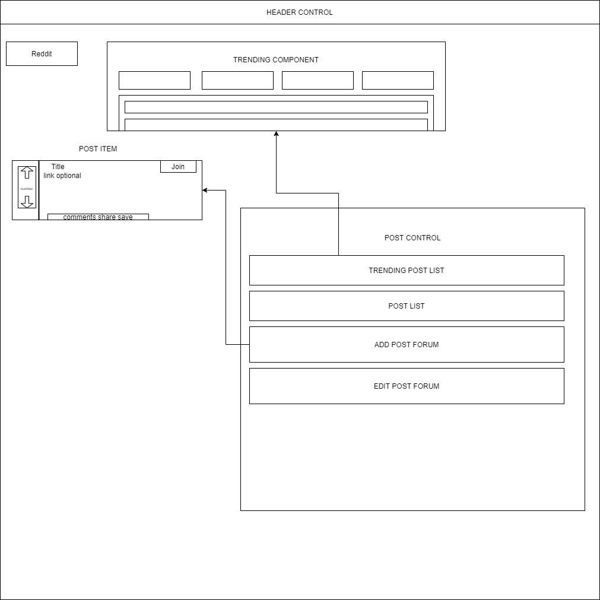

# [Mini Reddit]()

#### _React Application with full CRUD Functionality, 04.28.2020_

#### By _**Krista Rutz, Andrew Philpott, Steven Fleming**_

<!--  -->

## Project Overview

Sites like Reddit, HackerNews and others offer a collection of different pages or forums where users may post news, pictures, and other information around a certain topic. Other users can then upvote or downvote content. The more upvotes an item receives, the higher it's displayed on the list. Recreate a basic subreddit and/or vote-based discussion board using React and Redux. Here are some user stories to get you started:

As a user, I want to enter content into a form and submit to create a new post.
As a user, I want my new posts to include a timestamp. And I want to see when other listings were posted, too.
As a user, I want to upvote posts I particularly enjoy.
As a user, I want to downvote posts I don't like, or find inappropriate.
As a user, I'd like posts with the most upvotes to appear higher on the page. (We haven't explicitly covered this in our curriculum, but here's a hint: You can complete logic before the return statement of a mapStateToProps() method!)

---

### Component Diagram

In the project directory, you can run:

### `npm start`

Runs the app in the development mode. 
Open [http://localhost:3000](http://localhost:3000) to view it in the browser.

The page will reload if you make edits. 
You will also see any lint errors in the console.

### `npm test`

Launches the test runner in the interactive watch mode. 
See the section about [running tests](https://facebook.github.io/create-react-app/docs/running-tests) for more information.

### `npm run build`

Builds the app for production to the `build` folder. 
It correctly bundles React in production mode and optimizes the build for the best performance.

The build is minified and the filenames include the hashes. 
Your app is ready to be deployed!

See the section about [deployment](https://facebook.github.io/create-react-app/docs/deployment) for more information.

### `npm run eject`

**Note: this is a one-way operation. Once you `eject`, you can’t go back!**

If you aren’t satisfied with the build tool and configuration choices, you can `eject` at any time. This command will remove the single build dependency from your project.

Instead, it will copy all the configuration files and the transitive dependencies (webpack, Babel, ESLint, etc) right into your project so you have full control over them. All of the commands except `eject` will still work, but they will point to the copied scripts so you can tweak them. At this point you’re on your own.

You don’t have to ever use `eject`. The curated feature set is suitable for small and middle deployments, and you shouldn’t feel obligated to use this feature. However we understand that this tool wouldn’t be useful if you couldn’t customize it when you are ready for it.

## Learn More

You can learn more in the [Create React App documentation](https://facebook.github.io/create-react-app/docs/getting-started).

To learn React, check out the [React documentation](https://reactjs.org/).

### Code Splitting

This section has moved here: https://facebook.github.io/create-react-app/docs/code-splitting

### Analyzing the Bundle Size

This section has moved here: https://facebook.github.io/create-react-app/docs/analyzing-the-bundle-size

### Making a Progressive Web App

This section has moved here: https://facebook.github.io/create-react-app/docs/making-a-progressive-web-app

### Advanced Configuration

This section has moved here: https://facebook.github.io/create-react-app/docs/advanced-configuration

### Deployment

This section has moved here: https://facebook.github.io/create-react-app/docs/deployment

### `npm run build` fails to minify

This section has moved here: https://facebook.github.io/create-react-app/docs/troubleshooting#npm-run-build-fails-to-minifyThis section has moved here: https://facebook.github.io/create-react-app/docs/troubleshooting#npm-run-build-fails-to-minify
